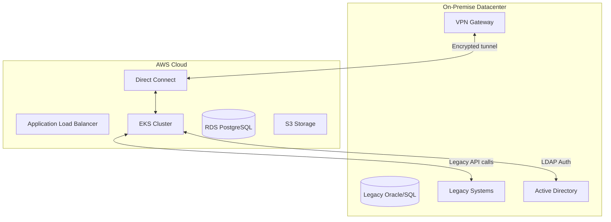
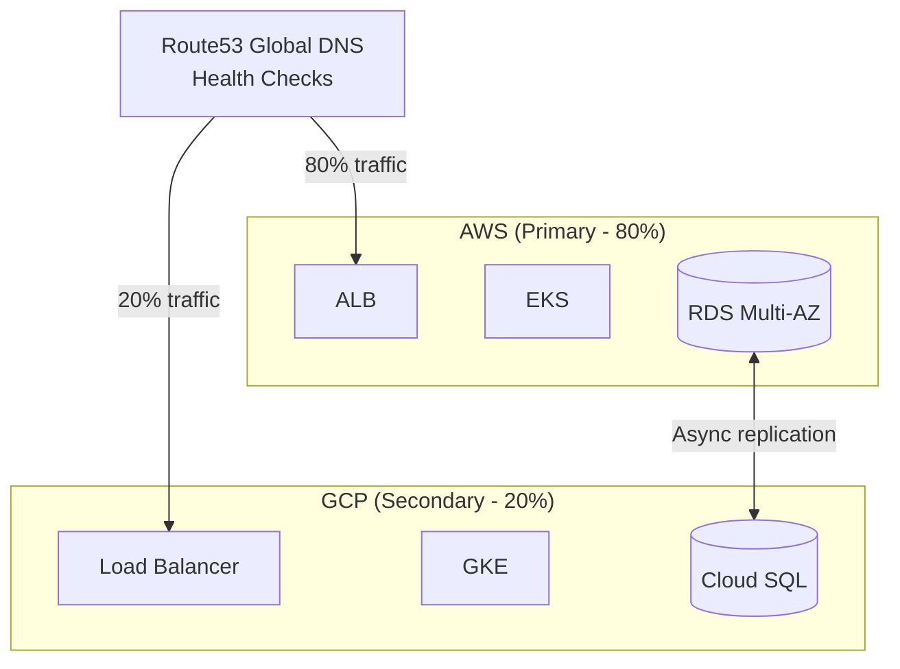

## Multi-Cloud Strategy

The GovTech platform uses the **Factory + Interface pattern** to enable cloud provider portability. The application code remains unchanged - only the infrastructure provider implementation changes.

### How Portability Works

```javascript
Application (routes, controllers)
    |
    v
ServiceFactory.getStorageService()   // reads CLOUD_PROVIDER from .env
    |
    +-- CLOUD_PROVIDER=aws   --> AwsStorageService
    +-- CLOUD_PROVIDER=oci   --> OciStorageService
    +-- CLOUD_PROVIDER=gcp   --> GcpStorageService
    +-- CLOUD_PROVIDER=azure --> AzureStorageService
```

<Info>
To migrate from AWS to OCI: change `CLOUD_PROVIDER=oci` in `.env` and deploy the OCI service implementations. The application code requires zero changes.
</Info>

## Service Mapping Across Providers

| Service Interface | AWS | OCI | GCP | Azure |
|------------------|-----|-----|-----|-------|
| **StorageService** | S3 | Object Storage | Cloud Storage | Blob Storage |
| **DatabaseService** | RDS PostgreSQL | DB Service | Cloud SQL | Database for PostgreSQL |
| **MonitoringService** | CloudWatch | Monitoring | Cloud Operations | Azure Monitor |
| **AuthService** | IAM / Cognito | Identity Cloud | Firebase Auth | Azure AD |
| **Container Registry** | ECR | OCIR | Artifact Registry | ACR |
| **Kubernetes** | EKS | OKE | GKE | AKS |
| **Load Balancer** | ALB | Load Balancer | Cloud Load Balancing | Load Balancer |
| **DNS** | Route 53 | DNS | Cloud DNS | Azure DNS |
| **Secrets** | Secrets Manager | Vault Service | Secret Manager | Key Vault |
| **CI/CD Auth** | OIDC + IAM Role | OIDC + IAM | Workload Identity | Managed Identity |

## Architecture Patterns

### 1. Hybrid Cloud (On-Premise + Cloud)

For organizations with existing data centers that cannot be fully migrated:



<Accordion title="Use Cases">
- Government agencies with mainframe systems that cannot be decommissioned
- Regulatory requirements to keep certain data on-premise
- Gradual migration over multiple years
- Integration with existing Active Directory/LDAP
</Accordion>

### 2. Multi-Cloud Active-Active

For maximum availability with multiple cloud providers:



<CardGroup cols={2}>
  <Card title="Benefits" icon="check">
    - 99.99% availability (52 min downtime/year)
    - No single cloud vendor lock-in
    - Automatic failover on region failure
    - Compliance with multi-provider requirements
  </Card>
  
  <Card title="Considerations" icon="exclamation-triangle">
    - 2x infrastructure cost
    - Data replication complexity
    - Increased operational overhead
    - Cross-cloud latency for sync
  </Card>
</CardGroup>

## Service Interface Contracts

Each cloud provider MUST implement these exact method signatures:

### StorageService Interface

```javascript src/services/providers/storage.interface.js
class StorageService {
  // Upload file to bucket/container
  async uploadFile(bucketName, key, body, contentType) {}

  // Download file from bucket
  async downloadFile(bucketName, key) {}  // returns Buffer

  // Delete file from bucket
  async deleteFile(bucketName, key) {}

  // List files with optional prefix
  async listFiles(bucketName, prefix = '') {}  
  // returns [{ key, size, lastModified }]

  // Generate temporary access URL (pre-signed)
  async getSignedUrl(bucketName, key, expiresInSeconds = 3600) {}  
  // returns string URL
}
```

### DatabaseService Interface

```javascript src/services/providers/database.interface.js
class DatabaseService {
  // Execute SQL query
  async query(sql, params = []) {}  
  // returns { rows: [], rowCount: number }

  // Transaction management
  async beginTransaction() {}
  async commitTransaction(client) {}
  async rollbackTransaction(client) {}

  // Health check
  async ping() {}  
  // returns { status: 'healthy' | 'unhealthy', latencyMs: number }
}
```

### MonitoringService Interface

```javascript src/services/providers/monitoring.interface.js
class MonitoringService {
  // Record numeric metric
  async putMetric(namespace, metricName, value, unit = 'Count') {}

  // Log event
  async logEvent(logGroup, message, level = 'INFO') {}

  // Create/update alarm
  async createAlarm(alarmName, metricName, threshold, comparison) {}

  // Get recent metrics
  async getMetrics(namespace, metricName, periodMinutes = 60) {}
  // returns [{ timestamp, value }]
}
```

## Service Factory Implementation

The factory selects the correct provider based on environment configuration:

```javascript src/services/factory.js
const PROVIDER = process.env.CLOUD_PROVIDER || 'aws';

const PROVIDERS = {
  aws: {
    storage:    () => new (require('./providers/aws/aws-storage.service').AwsStorageService)(),
    database:   () => new (require('./providers/aws/aws-database.service').AwsDatabaseService)(),
    monitoring: () => new (require('./providers/aws/aws-monitoring.service').AwsMonitoringService)(),
    auth:       () => new (require('./providers/aws/aws-auth.service').AwsAuthService)(),
  },
  // Add OCI, GCP, Azure implementations as needed
};

function getService(type) {
  const provider = PROVIDERS[PROVIDER];
  if (!provider) {
    throw new Error(`Provider '${PROVIDER}' not implemented. Options: ${Object.keys(PROVIDERS).join(', ')}`);
  }
  return provider[type]();
}

module.exports = {
  getStorageService:    () => getService('storage'),
  getDatabaseService:   () => getService('database'),
  getMonitoringService: () => getService('monitoring'),
  getAuthService:       () => getService('auth'),
};
```

## Environment Variables by Provider

<Tabs>
  <Tab title="AWS">
    ```env
    CLOUD_PROVIDER=aws
    AWS_REGION=us-east-1
    AWS_ACCOUNT_ID=835960996869
    # Credentials via IRSA (no hardcoded keys)
    ```
  </Tab>
  
  <Tab title="OCI">
    ```env
    CLOUD_PROVIDER=oci
    OCI_REGION=us-ashburn-1
    OCI_TENANCY_ID=ocid1.tenancy.oc1..xxx
    OCI_USER_ID=ocid1.user.oc1..xxx
    OCI_FINGERPRINT=xx:xx:xx:xx
    OCI_PRIVATE_KEY_PATH=/secrets/oci-private-key.pem
    OCI_NAMESPACE=govtech-namespace
    ```
  </Tab>
  
  <Tab title="GCP">
    ```env
    CLOUD_PROVIDER=gcp
    GCP_PROJECT_ID=govtech-prod
    GCP_REGION=us-central1
    GOOGLE_APPLICATION_CREDENTIALS=/secrets/gcp-sa-key.json
    ```
  </Tab>
  
  <Tab title="Azure">
    ```env
    CLOUD_PROVIDER=azure
    AZURE_TENANT_ID=xxx
    AZURE_CLIENT_ID=xxx
    AZURE_SUBSCRIPTION_ID=xxx
    AZURE_STORAGE_ACCOUNT=govtechstorage
    # DefaultAzureCredential handles authentication
    ```
  </Tab>
</Tabs>

## Migration Process Between Clouds

### Step 1: Infrastructure Preparation

```bash
# Example: Migrating from AWS to OCI
cd terraform/environments/prod

# Create OCI-specific Terraform configuration
terraform init
terraform plan -var="cloud_provider=oci"
terraform apply
```

### Step 2: Data Migration

```bash
# S3 → OCI Object Storage (using rclone)
rclone sync s3:govtech-documents oci:govtech-documents

# RDS PostgreSQL → OCI Database Service
pg_dump -h rds-endpoint.us-east-1.rds.amazonaws.com govtech_prod | \
  psql -h oci-db-endpoint.us-ashburn-1.oraclecloud.com govtech_prod
```

### Step 3: Service Implementation

Implement the 4 required services for the target provider following the interface contracts.

### Step 4: Activate Provider

```bash
# Update environment variable
kubectl set env deployment/govtech-backend CLOUD_PROVIDER=oci

# Monitor rollout
kubectl rollout status deployment/govtech-backend
```

## What Changes vs. What Stays

<CardGroup cols={2}>
  <Card title="Unchanged" icon="circle-check" color="#16a34a">
    - Application code (Node.js/React)
    - Database schema (PostgreSQL)
    - Kubernetes manifests
    - CI/CD pipelines (change registry only)
    - Security policies
    - API contracts
  </Card>
  
  <Card title="Changes Required" icon="wrench" color="#ea580c">
    - Environment variables (endpoints, regions)
    - IAM policies (each cloud has different model)
    - Ingress configuration (ALB vs GCP LB)
    - Storage classes (gp3 vs pd-ssd)
    - Service implementations (4 files per provider)
  </Card>
</CardGroup>

## Real-World Examples

<Accordion title="Estonia e-Government">
**Population**: 1.3M citizens  
**Architecture**: AWS + on-premise hybrid  
**Result**: 99% of government services online  
**Migration Time**: Incremental over 10 years (started 2001)
</Accordion>

<Accordion title="Colombia GOV.CO">
**Population**: 50M citizens  
**Architecture**: Multi-cloud (AWS + on-premise)  
**Migration Time**: 3 years (2020-2023) to consolidate 1,000+ services  
**Challenge**: Legacy systems from 50+ government entities
</Accordion>

<Accordion title="Singapore SingPass">
**Population**: 5.8M citizens  
**Architecture**: Multi-cloud + hybrid  
**Availability**: 99.99% uptime  
**Transactions**: 500K/day  
**Security**: National Critical Infrastructure Protection
</Accordion>

<Check>
The GovTech platform is designed from day one for cloud portability, reducing vendor lock-in risk and enabling governments to switch providers based on cost, compliance, or policy requirements.
</Check>