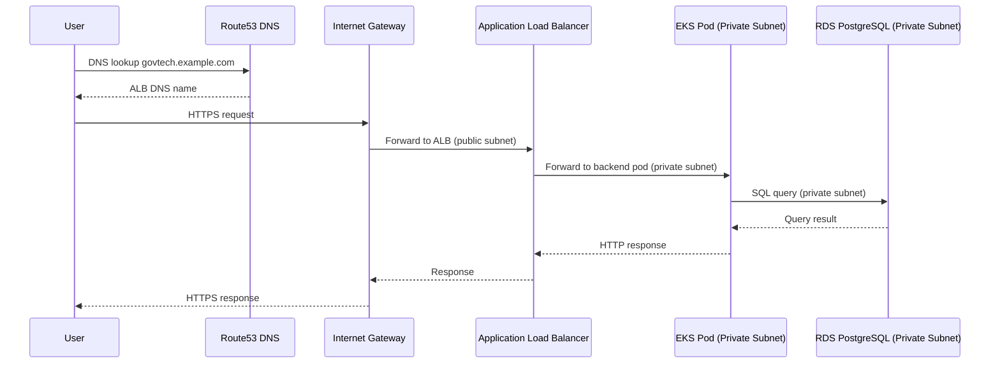
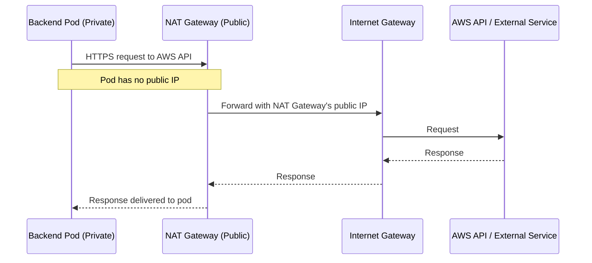

## VPC Architecture Overview

The GovTech platform uses a **private-by-default** architecture. All application components run in private subnets with no direct internet access.

### Network Principle

<Note>
No critical resources (EKS nodes, RDS) are accessible directly from the internet. All traffic enters through the Application Load Balancer in public subnets.
</Note>

## VPC CIDR Ranges

| Environment | VPC CIDR | Available IPs | Purpose |
|-------------|----------|---------------|----------|
| **Development** | 10.0.0.0/16 | 65,536 | govtech-dev cluster |
| **Staging** | 10.1.0.0/16 | 65,536 | govtech-staging cluster |
| **Production** | 10.2.0.0/16 | 65,536 | govtech-prod cluster |

<Info>
Separate VPCs per environment ensure complete isolation. A breach in dev cannot affect production.
</Info>

## Subnet Layout

### Production VPC (10.2.0.0/16)

```
VPC: 10.2.0.0/16 (65,536 IPs)
│
├── PUBLIC SUBNETS (ALB, NAT Gateway)
│   ├── us-east-1a: 10.2.1.0/24  (256 IPs)
│   ├── us-east-1b: 10.2.2.0/24  (256 IPs)
│   └── us-east-1c: 10.2.3.0/24  (256 IPs)
│
└── PRIVATE SUBNETS (EKS nodes, RDS)
    ├── us-east-1a: 10.2.10.0/24 (256 IPs)
    ├── us-east-1b: 10.2.11.0/24 (256 IPs)
    └── us-east-1c: 10.2.12.0/24 (256 IPs)
```

### Terraform Configuration

```hcl terraform/environments/prod/main.tf
module "networking" {
  source = "../../modules/networking"

  environment  = "prod"
  region       = "us-east-1"
  project_name = "govtech"
  vpc_cidr     = "10.2.0.0/16"

  availability_zones   = ["us-east-1a", "us-east-1b", "us-east-1c"]
  public_subnet_cidrs  = ["10.2.1.0/24", "10.2.2.0/24", "10.2.3.0/24"]
  private_subnet_cidrs = ["10.2.10.0/24", "10.2.11.0/24", "10.2.12.0/24"]
}
```

## Network Components

### Internet Gateway

Connects the VPC to the internet:

```hcl terraform/modules/networking/aws.tf
resource "aws_internet_gateway" "main" {
  vpc_id = aws_vpc.main.id

  tags = {
    Name        = "govtech-igw-prod"
    Environment = "prod"
  }
}
```

<CardGroup cols={2}>
  <Card title="Purpose" icon="door-open">
    Allows resources in public subnets to communicate with the internet
  </Card>
  <Card title="Usage" icon="diagram-project">
    - ALB receives HTTPS traffic from internet
    - NAT Gateways route private subnet traffic out
  </Card>
</CardGroup>

### NAT Gateways (One per AZ)

Enables private subnet resources to access the internet:

```hcl terraform/modules/networking/aws.tf
# Elastic IPs for NAT Gateways
resource "aws_eip" "nat" {
  count  = length(var.availability_zones)
  domain = "vpc"

  depends_on = [aws_internet_gateway.main]
}

# NAT Gateway per AZ for high availability
resource "aws_nat_gateway" "main" {
  count         = length(var.availability_zones)
  allocation_id = aws_eip.nat[count.index].id
  subnet_id     = aws_subnet.public[count.index].id

  tags = {
    Name = "govtech-nat-${var.availability_zones[count.index]}-prod"
  }
}
```

<Accordion title="Why one NAT Gateway per AZ?">
**High Availability**: If NAT Gateway in us-east-1a fails, pods in us-east-1b and us-east-1c continue functioning.

**Cost**: Each NAT Gateway costs ~$32/month + data transfer. Development can use 1 NAT to save costs.

**Use Cases**:
- EKS pods downloading packages from npm, PyPI
- Backend calling external APIs (payment, email)
- Container images pulled from ECR
</Accordion>

## Routing Tables

### Public Subnet Route Table

All internet traffic goes through Internet Gateway:

```hcl terraform/modules/networking/aws.tf
resource "aws_route_table" "public" {
  vpc_id = aws_vpc.main.id

  route {
    cidr_block = "0.0.0.0/0"                 # All traffic
    gateway_id = aws_internet_gateway.main.id # to Internet Gateway
  }

  tags = {
    Name = "govtech-rt-public-prod"
  }
}

resource "aws_route_table_association" "public" {
  count          = length(var.availability_zones)
  subnet_id      = aws_subnet.public[count.index].id
  route_table_id = aws_route_table.public.id
}
```

### Private Subnet Route Tables (One per AZ)

Each AZ routes through its own NAT Gateway:

```hcl
resource "aws_route_table" "private" {
  count  = length(var.availability_zones)
  vpc_id = aws_vpc.main.id

  route {
    cidr_block     = "0.0.0.0/0"                      # All external traffic
    nat_gateway_id = aws_nat_gateway.main[count.index].id # to NAT in same AZ
  }

  tags = {
    Name = "govtech-rt-private-${var.availability_zones[count.index]}-prod"
  }
}

resource "aws_route_table_association" "private" {
  count          = length(var.availability_zones)
  subnet_id      = aws_subnet.private[count.index].id
  route_table_id = aws_route_table.private[count.index].id
}
```

## Security Groups

### EKS Cluster Security Group

Controls traffic to/from EKS nodes:

```hcl terraform/modules/networking/aws.tf
resource "aws_security_group" "eks_cluster" {
  name        = "govtech-eks-sg-prod"
  description = "Security group for EKS cluster"
  vpc_id      = aws_vpc.main.id

  # INGRESS: Allow HTTPS from anywhere (ALB)
  ingress {
    description = "HTTPS from internet"
    from_port   = 443
    to_port     = 443
    protocol    = "tcp"
    cidr_blocks = ["0.0.0.0/0"]
  }

  # INGRESS: Allow HTTP (redirects to HTTPS)
  ingress {
    description = "HTTP redirect to HTTPS"
    from_port   = 80
    to_port     = 80
    protocol    = "tcp"
    cidr_blocks = ["0.0.0.0/0"]
  }

  # INGRESS: Allow internal cluster communication
  ingress {
    description = "Internal EKS communication"
    from_port   = 0
    to_port     = 0
    protocol    = "-1"  # All protocols
    self        = true  # Only from this security group
  }

  # EGRESS: Allow all outbound (for updates, AWS APIs)
  egress {
    description = "All outbound traffic"
    from_port   = 0
    to_port     = 0
    protocol    = "-1"
    cidr_blocks = ["0.0.0.0/0"]
  }
}
```

### RDS Security Group

Database only accessible from EKS:

```hcl terraform/modules/networking/aws.tf
resource "aws_security_group" "rds" {
  name        = "govtech-rds-sg-prod"
  description = "Security group for RDS PostgreSQL - only EKS access"
  vpc_id      = aws_vpc.main.id

  # INGRESS: PostgreSQL only from EKS security group
  ingress {
    description     = "PostgreSQL from EKS only"
    from_port       = 5432
    to_port         = 5432
    protocol        = "tcp"
    security_groups = [aws_security_group.eks_cluster.id]
  }

  # EGRESS: Allow outbound (for replication if Multi-AZ)
  egress {
    description = "Outbound traffic"
    from_port   = 0
    to_port     = 0
    protocol    = "-1"
    cidr_blocks = ["0.0.0.0/0"]
  }
}
```

<Warning>
RDS security group only accepts connections from the EKS security group. No direct internet access possible.
</Warning>

## Traffic Flow

### User Request Flow



### Pod Outbound Request Flow



## Subnet Tagging for EKS

EKS Load Balancer Controller uses tags to discover subnets:

```hcl terraform/modules/networking/aws.tf
# Public subnets (for ALB)
resource "aws_subnet" "public" {
  tags = {
    "kubernetes.io/role/elb" = "1"  # Used by ALB controller
    "kubernetes.io/cluster/govtech-prod" = "shared"
  }
}

# Private subnets (for internal load balancers)
resource "aws_subnet" "private" {
  tags = {
    "kubernetes.io/role/internal-elb" = "1"  # For internal LBs
    "kubernetes.io/cluster/govtech-prod" = "shared"
  }
}
```

## Multi-AZ High Availability

<Steps>
  <Step title="Availability Zone Failure">
    If us-east-1a fails completely:
    - ALB stops routing to pods in AZ-a
    - Pods in us-east-1b and us-east-1c continue serving traffic
    - NAT Gateways in AZ-b and AZ-c still operational
    - RDS fails over to standby in different AZ (Multi-AZ enabled)
  </Step>
  
  <Step title="Automatic Recovery">
    - EKS Auto Scaling Group launches new nodes in healthy AZs
    - Kubernetes reschedules pods from failed AZ
    - Total downtime: 2-5 minutes for pod rescheduling
  </Step>
  
  <Step title="RDS Failover">
    - RDS automatically fails over to standby instance
    - DNS endpoint updated to point to new primary
    - Application connection briefly drops, then reconnects
    - Failover time: 60-120 seconds
  </Step>
</Steps>

## Network Performance

| Metric | Value | Notes |
|--------|-------|-------|
| **VPC Bandwidth** | Up to 100 Gbps | Instance type dependent |
| **NAT Gateway** | Up to 100 Gbps | Scales automatically |
| **ALB** | Auto-scales | No bandwidth limit |
| **Inter-AZ Latency** | < 2ms | us-east-1 region |
| **RDS Multi-AZ Sync** | Synchronous | < 1ms replication lag |

## VPC Endpoints (Optional Enhancement)

For enhanced security and reduced NAT costs:

```hcl
# S3 VPC Endpoint (free, no NAT required)
resource "aws_vpc_endpoint" "s3" {
  vpc_id       = aws_vpc.main.id
  service_name = "com.amazonaws.us-east-1.s3"
  
  route_table_ids = aws_route_table.private[*].id
}

# ECR VPC Endpoint (saves NAT bandwidth costs)
resource "aws_vpc_endpoint" "ecr_dkr" {
  vpc_id              = aws_vpc.main.id
  service_name        = "com.amazonaws.us-east-1.ecr.dkr"
  vpc_endpoint_type   = "Interface"
  subnet_ids          = aws_subnet.private[*].id
  security_group_ids  = [aws_security_group.eks_cluster.id]
  private_dns_enabled = true
}
```

<Info>
VPC Endpoints allow pods to access AWS services without using NAT Gateway, reducing costs and improving security.
</Info>

## Network Cost Optimization

<AccordionGroup>
  <Accordion title="Development (Cost-Optimized)">
    - **Single NAT Gateway**: Use only one NAT Gateway instead of 3
    - **2 AZs**: Deploy across 2 AZs instead of 3
    - **Savings**: ~$128/month (2 NAT Gateways)
    - **Trade-off**: No AZ-level redundancy for NAT
  </Accordion>
  
  <Accordion title="Staging (Balanced)">
    - **3 NAT Gateways**: Full redundancy
    - **3 AZs**: Production-like architecture
    - **VPC Endpoints**: S3 and ECR endpoints
    - **Cost**: ~$96/month for NAT
  </Accordion>
  
  <Accordion title="Production (High Availability)">
    - **3 NAT Gateways**: One per AZ for redundancy
    - **3 AZs**: us-east-1a, 1b, 1c
    - **VPC Endpoints**: All AWS services
    - **Cost**: ~$96/month + data transfer
    - **Benefit**: Zero downtime during AZ failure
  </Accordion>
</AccordionGroup>

## Verification Commands

```bash
# List VPC
aws ec2 describe-vpcs --filters Name=tag:Project,Values=govtech

# List subnets
aws ec2 describe-subnets --filters Name=vpc-id,Values=vpc-xxx

# Check route tables
aws ec2 describe-route-tables --filters Name=vpc-id,Values=vpc-xxx

# Verify NAT Gateways
aws ec2 describe-nat-gateways --filter Name=vpc-id,Values=vpc-xxx

# Test connectivity from pod
kubectl exec -it backend-pod -- curl https://api.github.com
```

<Check>
The network architecture provides defense-in-depth with private-by-default resources, multi-AZ redundancy, and fine-grained security group controls.
</Check>