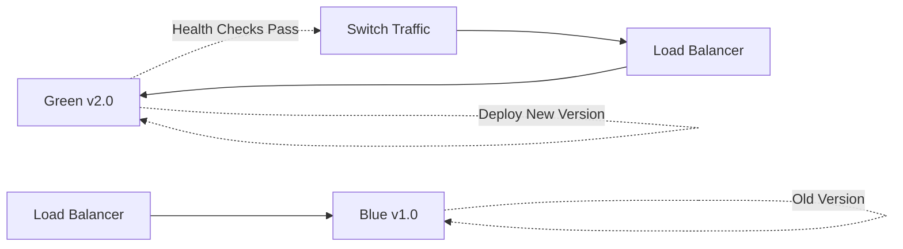

## Overview

The GovTech platform uses two deployment workflows:

1. **Deploy to Dev** - Automatic deployment to development environment
2. **Deploy to Production** - Manual blue-green deployment with approval gates

## Deployment Strategy


## Deploy to Dev Workflow

**File:** `.github/workflows/deploy-dev.yml`

### Purpose

Automatically deploy to development environment when code is pushed to `staging` branch.

### Trigger

```yaml
on:
  push:
    branches: [staging]
```

**Source:** deploy-dev.yml:5-7

**Execution:** Automatic, no manual approval required.

### Environment

```yaml
environment: dev
```

**GitHub Environment:** `dev` (can configure secrets and protection rules)

### Job: Deploy

**Full workflow:** deploy-dev.yml:10-91

#### Step 1: AWS Authentication

```yaml
- name: Configure AWS credentials
  uses: aws-actions/configure-aws-credentials@v4
  with:
    aws-access-key-id: ${{ secrets.AWS_ACCESS_KEY_ID }}
    aws-secret-access-key: ${{ secrets.AWS_SECRET_ACCESS_KEY }}
    aws-region: us-east-1
```

**Source:** deploy-dev.yml:19-24

**Note:** Still using legacy access keys. **Recommended:** Migrate to OIDC like CI workflows.

#### Step 2: Terraform Infrastructure Provisioning

**Setup Terraform:**
```yaml
- name: Setup Terraform
  uses: hashicorp/setup-terraform@v3
  with:
    terraform_version: "1.6.0"
```

**Source:** deploy-dev.yml:29-32

**Terraform Workflow:**

1. **Initialize** (deploy-dev.yml:34-36):
   ```bash
   terraform init
   ```
   Downloads providers and modules.

2. **Plan** (deploy-dev.yml:38-43):
   ```bash
   terraform plan -out=tfplan
   ```
   Generates execution plan with changes.
   
   **Environment Variables:**
   ```yaml
   env:
     TF_VAR_environment: dev
     TF_VAR_db_password: ${{ secrets.DB_PASSWORD }}
   ```

3. **Apply** (deploy-dev.yml:45-47):
   ```bash
   terraform apply -auto-approve tfplan
   ```
   Creates/updates infrastructure automatically.

**Working Directory:** `./terraform/environments/dev`

**What Terraform Provisions:**
- EKS cluster (`govtech-dev`)
- RDS database
- VPC and networking
- IAM roles and policies
- ECR repositories

#### Step 3: Kubernetes Deployment

**Setup kubectl:**
```yaml
- name: Setup kubectl
  uses: azure/setup-kubectl@v3
  with:
    version: 'v1.28.0'
```

**Source:** deploy-dev.yml:52-55

**Connect to EKS:**
```bash
aws eks update-kubeconfig --name govtech-dev --region us-east-1
```

**Source:** deploy-dev.yml:58

**Deploy Kubernetes Resources:**
```bash
kubectl apply -f kubernetes/namespace.yaml
kubectl apply -f kubernetes/configmap.yaml
kubectl apply -f kubernetes/backend/deployment.yaml
kubectl apply -f kubernetes/backend/service.yaml
kubectl apply -f kubernetes/frontend/deployment.yaml
kubectl apply -f kubernetes/frontend/service.yaml
```

**Source:** deploy-dev.yml:64-71

**Resources Deployed:**
- Namespace: `govtech`
- ConfigMap: Application configuration
- Backend Deployment and Service
- Frontend Deployment and Service

#### Step 4: Wait for Rollout

```bash
kubectl rollout status deployment/backend -n govtech --timeout=300s
kubectl rollout status deployment/frontend -n govtech --timeout=300s
```

**Source:** deploy-dev.yml:73-77

**Behavior:**
- Waits up to 5 minutes for pods to be ready
- Fails deployment if rollout doesn't complete
- Ensures zero-downtime deployment

#### Step 5: Smoke Tests

```bash
echo "Verificando pods..."
kubectl get pods -n govtech

echo "Verificando services..."
kubectl get services -n govtech
```

**Source:** deploy-dev.yml:82-90

**Purpose:** Basic verification that resources are running.

### Dev Deployment Timeline

```mermaid
gantt
    title Deploy to Dev Timeline
    dateFormat  ss
    section Terraform
    Init           :00, 10s
    Plan           :10s, 15s
    Apply          :25s, 60s
    section Kubernetes
    Deploy         :85s, 10s
    Rollout        :95s, 120s
    Smoke Tests    :215s, 5s
```

**Total Time:** ~3-4 minutes

## Deploy to Production Workflow

**File:** `.github/workflows/deploy-prod.yml`

### Purpose

Manual blue-green deployment to production environment with validation and rollback capability.

### Trigger

```yaml
on:
  workflow_dispatch:
    inputs:
      version:
        description: 'Tag o SHA de la imagen a desplegar'
        required: true
        default: 'latest'
      confirm:
        description: 'Escribe DEPLOY para confirmar'
        required: true
```

**Source:** deploy-prod.yml:5-14

**Execution:** Manual only, triggered from GitHub Actions UI.

**Required Inputs:**
- `version`: Docker image tag (SHA or `latest`)
- `confirm`: Must type `DEPLOY` to proceed

### Jobs

#### Job 1: Validate

**Purpose:** Prevent accidental deployments.

```yaml
validate:
  name: Validar confirmacion
  runs-on: ubuntu-latest
  steps:
    - name: Verificar confirmacion
      run: |
        if [ "${{ github.event.inputs.confirm }}" != "DEPLOY" ]; then
          echo "ERROR: Debes escribir DEPLOY para confirmar"
          exit 1
        fi
        echo "Confirmacion valida - iniciando deploy a produccion"
```

**Source:** deploy-prod.yml:17-27

**Behavior:**
- Fails immediately if user doesn't type "DEPLOY"
- Prevents typos or accidental clicks

#### Job 2: Deploy

**Dependencies:**
```yaml
deploy:
  name: Deploy Blue-Green a Produccion
  needs: validate
  runs-on: ubuntu-latest
  environment: production
```

**Source:** deploy-prod.yml:29-33

**Critical:** `environment: production` triggers GitHub Environment protection rules:
- Required reviewers (manual approval)
- Deployment branch restrictions
- Environment secrets

### Blue-Green Deployment Strategy

**Concept:**



**Steps:**

1. **Deploy GREEN (new version)** alongside existing BLUE
2. **Wait for health checks** to pass on GREEN
3. **Switch traffic** from BLUE to GREEN
4. **Keep BLUE running** for instant rollback if needed

#### Deploy GREEN Version

```bash
kubectl set image deployment/backend \
  backend=$ECR_REGISTRY/govtech-backend:$IMAGE_TAG \
  -n govtech \
  --record

kubectl set image deployment/frontend \
  frontend=$ECR_REGISTRY/govtech-frontend:$IMAGE_TAG \
  -n govtech \
  --record
```

**Source:** deploy-prod.yml:64-78

**Parameters:**
- `$IMAGE_TAG`: From workflow input (e.g., `abc123456`)
- `--record`: Save command in revision history for rollback
- `-n govtech`: Namespace

**Kubernetes Behavior:**
- Creates new ReplicaSet with new image
- Starts new pods (GREEN)
- Old pods (BLUE) remain running
- Traffic stays on BLUE until new pods are ready

#### Wait for GREEN Readiness

```bash
kubectl rollout status deployment/backend -n govtech --timeout=600s
kubectl rollout status deployment/frontend -n govtech --timeout=600s
```

**Source:** deploy-prod.yml:80-83

**Timeout:** 10 minutes (production rollout can be slower)

**What It Checks:**
- Pods pass readiness probes
- All replicas are ready
- No CrashLoopBackOff errors

#### Production Health Checks

```bash
# Get pod status
kubectl get pods -n govtech

# Check ready replicas
BACKEND_READY=$(kubectl get deployment backend -n govtech -o jsonpath='{.status.readyReplicas}')
FRONTEND_READY=$(kubectl get deployment frontend -n govtech -o jsonpath='{.status.readyReplicas}')

echo "Backend pods listos: $BACKEND_READY"
echo "Frontend pods listos: $FRONTEND_READY"

if [ "$BACKEND_READY" -lt "2" ]; then
  echo "ERROR: Backend no tiene suficientes replicas listas"
  exit 1
fi
```

**Source:** deploy-prod.yml:85-102

**Validation:**
- Backend must have at least 2 ready replicas
- Frontend must be running
- Fails deployment if health checks don't pass

**Result:** If any check fails, workflow exits and BLUE version continues serving traffic.

#### Traffic Switch

Kubernetes automatically switches traffic when:

1. New pods (GREEN) pass readiness probes
2. `kubectl rollout status` completes successfully
3. Service selector matches new pods

**No manual traffic switching required** - Kubernetes handles it.

#### Deployment Notification

```bash
echo "Version ${{ github.event.inputs.version }} desplegada en produccion"
echo "Por: ${{ github.actor }}"
echo "Fecha: $(date -u)"
```

**Source:** deploy-prod.yml:107-111

**Output Example:**
```
Version abc123456 desplegada en produccion
Por: admin-user
Fecha: 2026-03-03 14:23:45 UTC
```

#### Job 3: Rollback

**Purpose:** Automatic rollback if deployment fails.

```yaml
rollback:
  name: Rollback (si deploy falla)
  needs: deploy
  if: failure()
  runs-on: ubuntu-latest
  environment: production
```

**Source:** deploy-prod.yml:113-118

**Trigger:** Only runs if `deploy` job fails.

**Rollback Process:**

```bash
echo "Deploy fallido - ejecutando rollback automatico..."
kubectl rollout undo deployment/backend -n govtech
kubectl rollout undo deployment/frontend -n govtech
kubectl rollout status deployment/backend -n govtech --timeout=300s
kubectl rollout status deployment/frontend -n govtech --timeout=300s
echo "Rollback completado - version anterior restaurada"
```

**Source:** deploy-prod.yml:134-141

**Behavior:**
- Reverts to previous deployment revision
- Uses Kubernetes rollout history (`--record` from deploy step)
- Waits for rollback to complete
- Restores BLUE version automatically

**Result:** Zero downtime - BLUE version never stopped running.

## Deployment Comparison

| Feature | Deploy Dev | Deploy Prod |
|---------|------------|-------------|
| **Trigger** | Automatic (push to staging) | Manual (workflow_dispatch) |
| **Approval** | None | GitHub Environment reviewers |
| **Terraform** | Yes (auto-approve) | No (infrastructure pre-provisioned) |
| **Strategy** | Rolling update | Blue-green |
| **Rollback** | Manual | Automatic on failure |
| **Timeout** | 5 minutes | 10 minutes |
| **Health Checks** | Basic smoke tests | Replica count validation |
| **Environment** | `govtech-dev` EKS | `govtech-prod` EKS |

## Environment Configuration

### GitHub Environments

Configure in: **Repository Settings > Environments**

#### Dev Environment

```yaml
Name: dev
Protection Rules:
  - Required reviewers: None
  - Wait timer: 0 minutes
  - Deployment branches: staging
Secrets:
  - AWS_ACCESS_KEY_ID
  - AWS_SECRET_ACCESS_KEY
  - DB_PASSWORD
```

#### Production Environment

```yaml
Name: production
Protection Rules:
  - Required reviewers: [platform-admin, tech-lead]
  - Wait timer: 5 minutes
  - Deployment branches: main only
Secrets:
  - AWS_ACCESS_KEY_ID
  - AWS_SECRET_ACCESS_KEY
  - DB_PASSWORD_PROD
```

### Required Secrets

| Secret | Environment | Purpose |
|--------|-------------|----------|
| `AWS_ACCESS_KEY_ID` | dev, production | AWS authentication |
| `AWS_SECRET_ACCESS_KEY` | dev, production | AWS authentication |
| `DB_PASSWORD` | dev | RDS database password |
| `DB_PASSWORD_PROD` | production | Production database password |
| `AWS_DEPLOY_ROLE_ARN` | CI workflows | OIDC role ARN |

**Recommendation:** Migrate deployment workflows to OIDC (remove access keys).

## Kubernetes Resources Deployed

### Namespace

**File:** `kubernetes/namespace.yaml`

```yaml
apiVersion: v1
kind: Namespace
metadata:
  name: govtech
```

### ConfigMap

**File:** `kubernetes/configmap.yaml`

Contains:
- API endpoints
- Feature flags
- Non-sensitive configuration

### Backend Deployment

**File:** `kubernetes/backend/deployment.yaml`

Key settings:
```yaml
spec:
  replicas: 2  # Production
  replicas: 1  # Dev
  strategy:
    type: RollingUpdate
    rollingUpdate:
      maxUnavailable: 1
      maxSurge: 1
```

### Frontend Deployment

**File:** `kubernetes/frontend/deployment.yaml`

Serves static assets via Nginx.

### Services

Expose deployments:
- Backend: `ClusterIP` service on port 8080
- Frontend: `LoadBalancer` service on port 80

## Deployment Timeline

### Development Deployment

```
1. Push to staging branch
2. GitHub Actions triggered (instant)
3. Terraform apply (60-90 seconds)
4. Kubernetes apply (10 seconds)
5. Rollout wait (120-180 seconds)
6. Smoke tests (5 seconds)

Total: ~4 minutes
```

### Production Deployment

```
1. Trigger workflow_dispatch
2. Enter version and type DEPLOY
3. Manual approval wait (human time)
4. Deploy GREEN version (10 seconds)
5. Rollout wait (300-600 seconds)
6. Health checks (5 seconds)
7. Traffic switch (automatic)

Total: ~10 minutes (excluding approval wait)
```

## Best Practices

### Pre-deployment Checklist

- [ ] All CI checks passed
- [ ] Security scans passed
- [ ] Code reviewed and approved
- [ ] Database migrations tested
- [ ] Rollback plan documented

### During Deployment

- [ ] Monitor pod status: `kubectl get pods -n govtech -w`
- [ ] Check logs: `kubectl logs -f deployment/backend -n govtech`
- [ ] Verify metrics in monitoring dashboards
- [ ] Test critical user flows

### Post-deployment

- [ ] Verify application functionality
- [ ] Check error rates in APM
- [ ] Review deployment logs
- [ ] Update deployment documentation
- [ ] Notify stakeholders

### Rollback Procedures

**Automatic Rollback** (if deployment fails):
```bash
# Handled by rollback job automatically
```

**Manual Rollback** (if issues found after deployment):
```bash
# Check revision history
kubectl rollout history deployment/backend -n govtech

# Rollback to previous version
kubectl rollout undo deployment/backend -n govtech
kubectl rollout undo deployment/frontend -n govtech

# Rollback to specific revision
kubectl rollout undo deployment/backend -n govtech --to-revision=3
```

## Monitoring Deployments

### GitHub Actions UI

**View Workflow:**
1. Go to **Actions** tab
2. Select workflow run
3. View job logs and status

**Approve Production Deployment:**
1. Navigate to pending deployment
2. Click **Review deployments**
3. Select **production** environment
4. Click **Approve and deploy**

### kubectl Commands

```bash
# Watch pod status
kubectl get pods -n govtech -w

# View deployment status
kubectl rollout status deployment/backend -n govtech

# Check deployment events
kubectl describe deployment backend -n govtech

# View pod logs
kubectl logs -f deployment/backend -n govtech

# Check service endpoints
kubectl get svc -n govtech
```

### AWS EKS Console

**View Cluster:**
1. AWS Console > EKS
2. Select `govtech-dev` or `govtech-prod`
3. View **Workloads** tab
4. Monitor pod health

## Troubleshooting

### Deployment Stuck on Rollout

**Symptom:** `kubectl rollout status` times out.

**Diagnosis:**
```bash
# Check pod status
kubectl get pods -n govtech

# View pod events
kubectl describe pod <pod-name> -n govtech

# Check logs
kubectl logs <pod-name> -n govtech
```

**Common Causes:**
- Image pull errors (wrong tag or ECR permissions)
- Application crashes (check logs)
- Failed readiness probes (check probe configuration)
- Resource limits (insufficient CPU/memory)

### Terraform Apply Fails

**Symptom:** Terraform apply exits with error.

**Diagnosis:**
```bash
# Run plan locally
cd terraform/environments/dev
terraform plan

# Check state
terraform state list
```

**Common Causes:**
- Conflicting resource changes
- Missing AWS permissions
- State file lock

**Solution:**
```bash
# Force unlock (use with caution)
terraform force-unlock <lock-id>

# Refresh state
terraform refresh
```

### Rollback Fails

**Symptom:** `kubectl rollout undo` doesn't restore service.

**Diagnosis:**
```bash
# Check rollout history
kubectl rollout history deployment/backend -n govtech
```

**Solution:**
```bash
# Rollback to specific known-good revision
kubectl rollout undo deployment/backend -n govtech --to-revision=5

# Or manually set image to previous version
kubectl set image deployment/backend \
  backend=<ECR_REGISTRY>/govtech-backend:<PREVIOUS_SHA>
```

## Security Considerations

### Deployment Approvals

**Production deployments require:**
- Manual confirmation (type "DEPLOY")
- GitHub Environment reviewer approval
- Minimum 2 approvers recommended

### Secrets Management

**Current:** GitHub Secrets

**Recommended:** Migrate to:
- AWS Secrets Manager for database passwords
- AWS Systems Manager Parameter Store for configuration
- OIDC for AWS authentication (remove access keys)

### Audit Trail

**Logged Information:**
- Who triggered deployment (`${{ github.actor }}`)
- What version was deployed (`${{ github.event.inputs.version }}`)
- When deployment occurred (`date -u`)
- Deployment outcome (success/failure)

**Access Logs:**
- GitHub Actions run history (indefinite)
- Kubernetes audit logs (AWS CloudWatch)
- AWS CloudTrail (API calls)

## Related Documentation

- [CI/CD Pipeline Overview](/reference/cicd/pipelines)
- [Security Scanning](/reference/cicd/security-scanning)
- [Infrastructure as Code](/reference/infrastructure/terraform)
- [Kubernetes Configuration](/reference/infrastructure/kubernetes)