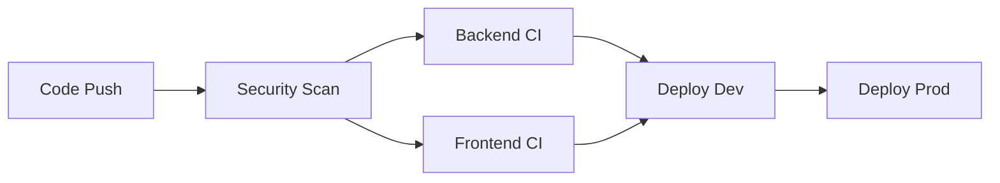
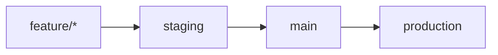

## Overview

The GovTech Multicloud Platform uses GitHub Actions for CI/CD automation across backend, frontend, and infrastructure components. All workflows implement security-first practices with OIDC authentication and comprehensive scanning.

## Pipeline Architecture



## Workflow Files

| Workflow | Trigger | Purpose |
|----------|---------|----------|
| `security-scan.yml` | PR/Push to main/staging | Security scanning on all code changes |
| `backend-ci.yml` | Push/PR to backend paths | Build, test, and publish backend images |
| `frontend-ci.yml` | Push/PR to frontend paths | Build, test, and publish frontend images |
| `deploy-dev.yml` | Push to staging | Auto-deploy to development environment |
| `deploy-prod.yml` | Manual workflow_dispatch | Blue-green production deployment |

## Backend CI Pipeline

**File:** `.github/workflows/backend-ci.yml`

### Triggers

```yaml
on:
  push:
    branches: [main, develop, staging]
    paths:
      - 'platform/app/backend/**'
  pull_request:
    branches: [main, staging]
    paths:
      - 'platform/app/backend/**'
```

### Jobs

#### 1. Test Job

Runs linting, security audits, and tests:

```bash
# Workflow steps
npm ci
npm run lint
npm audit --audit-level=high  # Fails on HIGH/CRITICAL vulnerabilities
npm test
```

**Key Features:**
- Node.js 20 with dependency caching
- Blocking security audit (no `|| true` bypass)
- Runs on every push and PR

#### 2. Build and Push Job

Builds Docker image, scans for vulnerabilities, and pushes to ECR:

**Prerequisites:**
- `needs: test` - Only runs after test job succeeds
- Condition: Push to main or staging branch only

**Steps:**

1. **OIDC Authentication** (backend-ci.yml:71-77)
   ```yaml
   - name: Configure AWS credentials (OIDC)
     uses: aws-actions/configure-aws-credentials@v4
     with:
       role-to-assume: ${{ secrets.AWS_DEPLOY_ROLE_ARN }}
       aws-region: us-east-1
   ```

2. **Build Docker Image** (backend-ci.yml:88-96)
   ```bash
   docker build -t $ECR_REGISTRY/govtech-backend:$IMAGE_TAG .
   docker tag $ECR_REGISTRY/govtech-backend:$IMAGE_TAG \
              $ECR_REGISTRY/govtech-backend:latest
   ```

3. **Trivy Vulnerability Scan** (backend-ci.yml:98-108)
   ```yaml
   - name: Scan image for vulnerabilities
     uses: aquasecurity/trivy-action@master
     with:
       image-ref: ${{ steps.login-ecr.outputs.registry }}/govtech-backend:${{ github.sha }}
       exit-code: '1'  # Fail pipeline on vulnerabilities
       severity: 'CRITICAL,HIGH'
       ignore-unfixed: true
   ```

4. **Push to ECR** (backend-ci.yml:110-119)
   - Only executes if Trivy scan passes
   - Pushes both SHA tag and latest tag

5. **Generate SBOM** (backend-ci.yml:126-139)
   ```yaml
   - name: Generate SBOM
     uses: aquasecurity/trivy-action@master
     with:
       format: 'cyclonedx'
       output: 'backend-sbom.json'
   
   - name: Upload SBOM artifact
     uses: actions/upload-artifact@v4
     with:
       retention-days: 90  # Compliance requirement
   ```

### Security Improvements

The workflow includes critical security fixes:

- **Removed `|| true` bypass** (backend-ci.yml:46-48): `npm audit` now blocks on HIGH/CRITICAL vulnerabilities
- **Scan before push** (backend-ci.yml:86-87): Vulnerable images never reach ECR
- **Exit code enforcement** (backend-ci.yml:103-105): Trivy fails pipeline instead of just reporting

## Frontend CI Pipeline

**File:** `.github/workflows/frontend-ci.yml`

### Triggers

```yaml
on:
  push:
    branches: [main, develop, staging]
    paths:
      - 'platform/app/frontend/**'
  pull_request:
    branches: [main, staging]
    paths:
      - 'platform/app/frontend/**'
```

### Jobs

#### 1. Test Job

```bash
npm ci
npm run lint
npm audit --audit-level=high  # Blocking
npm run build  # Production bundle
```

**Artifact Upload** (frontend-ci.yml:50-55):
```yaml
- name: Upload build artifact
  uses: actions/upload-artifact@v4
  with:
    name: frontend-dist
    path: platform/app/frontend/dist/
    retention-days: 7
```

#### 2. Build and Push Job

Identical to backend workflow:

1. OIDC authentication
2. Build Docker image (`govtech-frontend:$IMAGE_TAG`)
3. Trivy scan (blocks on CRITICAL/HIGH)
4. Push to ECR
5. Generate and upload SBOM (90-day retention)

## OIDC Authentication

All CI workflows use OpenID Connect instead of long-lived AWS access keys.

### Required Permissions

```yaml
permissions:
  id-token: write  # Request OIDC token from GitHub
  contents: read   # Checkout code
```

### Configuration

**Step:** Configure AWS credentials (backend-ci.yml:71-77)

```yaml
- name: Configure AWS credentials (OIDC)
  uses: aws-actions/configure-aws-credentials@v4
  with:
    role-to-assume: ${{ secrets.AWS_DEPLOY_ROLE_ARN }}
    aws-region: us-east-1
    # No AWS_ACCESS_KEY_ID or AWS_SECRET_ACCESS_KEY required
```

### Benefits

- **Temporary credentials**: Tokens expire in 1 hour
- **No secret storage**: No long-lived keys in GitHub Secrets
- **Audit trail**: AWS CloudTrail logs all OIDC authentications
- **Principle of least privilege**: IAM role has minimal required permissions

### Prerequisites

Requires OIDC provider configured in AWS (see Infrastructure documentation).

## Image Tags

All Docker images use dual tagging:

```bash
# SHA tag (immutable)
$ECR_REGISTRY/govtech-backend:abc1234567890abcdef

# Latest tag (mutable, tracks most recent build)
$ECR_REGISTRY/govtech-backend:latest
```

**Usage:**
- Development: Uses `latest` tag
- Production: Uses specific SHA tag for immutability

## SBOM Generation

Software Bill of Materials (SBOM) generation is mandatory for compliance.

### Format

**CycloneDX JSON** - Industry standard for dependency tracking

### Retention

- **Development SBOMs**: 7 days
- **Production SBOMs**: 90 days (compliance requirement)

### Contents

SBOM includes:
- All npm dependencies (direct and transitive)
- System packages in Docker base image
- Versions and license information
- Known CVEs for each component

### Access

Download from GitHub Actions artifacts:

```bash
gh run download <run-id> -n backend-sbom-<sha>
```

## Environment Variables

### GitHub Secrets Required

| Secret | Used In | Purpose |
|--------|---------|----------|
| `AWS_DEPLOY_ROLE_ARN` | backend-ci.yml, frontend-ci.yml | OIDC role for ECR access |
| `AWS_ACCESS_KEY_ID` | deploy-dev.yml, deploy-prod.yml | Legacy credential (migrate to OIDC) |
| `AWS_SECRET_ACCESS_KEY` | deploy-dev.yml, deploy-prod.yml | Legacy credential |
| `DB_PASSWORD` | deploy-dev.yml | Database password for Terraform |

### Workflow Outputs

```yaml
# backend-ci.yml:119
echo "image=$ECR_REGISTRY/$ECR_REPOSITORY:$IMAGE_TAG" >> $GITHUB_OUTPUT
```

Used by deployment workflows to reference built images.

## Path-based Triggers

Workflows only run when relevant files change:

```yaml
paths:
  - 'platform/app/backend/**'  # Backend CI
  - 'platform/app/frontend/**' # Frontend CI
```

**Benefits:**
- Faster CI runs
- Reduced GitHub Actions minutes
- Clear separation of concerns

## Branch Strategy



- **feature/**: Development branches, triggers security scans
- **staging**: Auto-deploys to dev environment
- **main**: Production-ready code, manual deployment

## Monitoring and Artifacts

### Artifact Retention

| Artifact | Retention | Purpose |
|----------|-----------|----------|
| Frontend build | 7 days | Static assets |
| Backend SBOM | 90 days | Compliance/audit |
| Frontend SBOM | 90 days | Compliance/audit |
| Semgrep results | 30 days | Security analysis |

### Status Checks

Required checks before merge:
- Security Scan (all jobs must pass)
- Backend CI: Test job
- Frontend CI: Test job

## Best Practices

### Do's

- Always scan images before pushing to ECR
- Use OIDC authentication for cloud providers
- Generate SBOMs for all production images
- Tag images with git SHA for traceability
- Set appropriate artifact retention periods

### Don'ts

- Don't use `|| true` to bypass security failures
- Don't push images before vulnerability scanning
- Don't use long-lived AWS access keys
- Don't skip SBOM generation
- Don't use `latest` tag in production deployments

## Troubleshooting

### npm audit failures

```bash
# Check vulnerabilities locally
npm audit --audit-level=high

# Update dependencies
npm audit fix

# Force update (may break compatibility)
npm audit fix --force
```

### Trivy scan failures

```bash
# Scan locally
docker run --rm -v /var/run/docker.sock:/var/run/docker.sock \
  aquasec/trivy image govtech-backend:latest

# Update base image in Dockerfile
FROM node:20-alpine  # Use latest patch version
```

### OIDC authentication errors

Check:
1. IAM role trust policy includes GitHub OIDC provider
2. `AWS_DEPLOY_ROLE_ARN` secret is correct
3. Workflow has `id-token: write` permission

## Related Documentation

- [Security Scanning](/reference/cicd/security-scanning)
- [Deployment Workflows](/reference/cicd/deployment-workflows)
- [Infrastructure as Code](/reference/infrastructure/terraform)