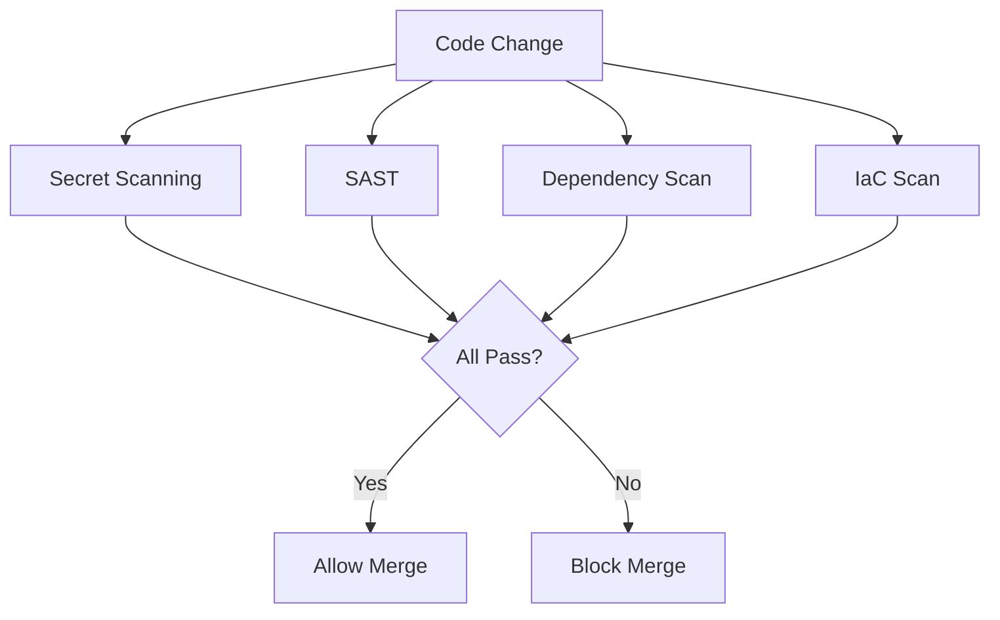
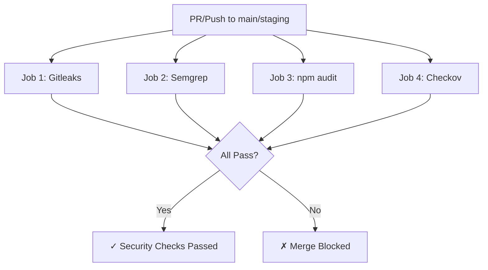

## Overview

The security scanning workflow (`security-scan.yml`) is the first line of defense for the GovTech platform. It runs on **all pull requests and pushes** to main/staging branches, blocking merges if vulnerabilities are detected.

**File:** `.github/workflows/security-scan.yml`

## Workflow Triggers

```yaml
on:
  pull_request:
    branches: [main, staging]
  push:
    branches: [main, staging]
```

**Execution:** Every PR and every push to protected branches runs all 4 security jobs.

## Security Jobs

The workflow consists of 4 independent jobs running in parallel:



### Job 1: Secret Scanning (Gitleaks)

**Purpose:** Detect hardcoded credentials, API keys, and secrets in code and git history.

#### Configuration

```yaml
secret-scan:
  name: Secret Scanning (Gitleaks)
  runs-on: ubuntu-latest
  steps:
    - name: Checkout code
      uses: actions/checkout@v4
      with:
        fetch-depth: 0  # Scan entire git history
    
    - name: Run Gitleaks
      uses: gitleaks/gitleaks-action@v2
      env:
        GITHUB_TOKEN: ${{ secrets.GITHUB_TOKEN }}
        GITLEAKS_LICENSE: ${{ secrets.GITLEAKS_LICENSE }}
```

**Source:** security-scan.yml:20-35

#### What It Detects

- AWS access keys and secret keys
- API tokens (GitHub, Stripe, Slack, etc.)
- Database connection strings with passwords
- Private SSH keys
- JWT secrets
- OAuth client secrets

#### Scan Scope

```bash
fetch-depth: 0  # Scans ALL commits in git history, not just latest
```

**Why full history?** Secrets may have been committed and removed in later commits. Gitleaks catches these.

#### Failure Behavior

Gitleaks exits with code 1 when secrets are found, automatically failing the job and blocking the PR merge.

#### Enterprise Features

```yaml
GITLEAKS_LICENSE: ${{ secrets.GITLEAKS_LICENSE }}
```

Required only for private enterprise repositories.

### Job 2: SAST - Static Application Security Testing (Semgrep)

**Purpose:** Analyze source code for security vulnerabilities and insecure patterns.

#### Configuration

```yaml
sast-scan:
  name: SAST (Semgrep)
  runs-on: ubuntu-latest
  container:
    image: returntocorp/semgrep
  steps:
    - name: Checkout code
      uses: actions/checkout@v4
    
    - name: Run Semgrep SAST
      run: |
        semgrep scan \
          --config=auto \
          --config=p/nodejs \
          --config=p/react \
          --config=p/jwt \
          --config=p/secrets \
          --config=p/owasp-top-ten \
          --error \
          --json \
          --output=semgrep-results.json \
          app/backend/src app/frontend/src
```

**Source:** security-scan.yml:44-76

#### Rule Sets

| Config | Detects |
|--------|----------|
| `--config=auto` | Language-specific best practices |
| `--config=p/nodejs` | Node.js security patterns (command injection, path traversal) |
| `--config=p/react` | React XSS, unsafe dangerouslySetInnerHTML |
| `--config=p/jwt` | Weak JWT algorithms (HS256 with hardcoded secret) |
| `--config=p/secrets` | Hardcoded credentials in code |
| `--config=p/owasp-top-ten` | OWASP Top 10 vulnerabilities |

#### Scan Targets

```bash
app/backend/src app/frontend/src
```

Only scans source code directories, not node_modules or build artifacts.

#### Output Formats

Two scan runs:

1. **JSON output** (security-scan.yml:54-65):
   ```bash
   --json --output=semgrep-results.json || true
   ```
   Stored as artifact for later analysis.

2. **CLI output** (security-scan.yml:68-76):
   ```bash
   semgrep scan --error app/backend/src app/frontend/src
   ```
   Prints human-readable results to workflow logs.

#### Failure Mode

```bash
--error  # Fail on any finding (not just warnings)
```

Semgrep exits with code 1 on findings, blocking the merge.

#### Artifacts

```yaml
- name: Upload Semgrep results
  if: always()
  uses: actions/upload-artifact@v4
  with:
    name: semgrep-results
    path: semgrep-results.json
    retention-days: 30
```

**Source:** security-scan.yml:78-84

**Access:** Download from GitHub Actions run page.

### Job 3: Dependency Vulnerability Scan (npm audit)

**Purpose:** Detect known vulnerabilities (CVEs) in npm dependencies.

#### Configuration

```yaml
dependency-scan:
  name: Dependency Vulnerability Scan
  runs-on: ubuntu-latest
  steps:
    - name: Checkout code
      uses: actions/checkout@v4
    
    - name: Setup Node.js 20
      uses: actions/setup-node@v4
      with:
        node-version: '20'
    
    - name: Audit backend dependencies
      working-directory: ./app/backend
      run: |
        npm ci --prefer-offline
        npm audit --audit-level=high
      continue-on-error: false
    
    - name: Audit frontend dependencies
      working-directory: ./app/frontend
      run: |
        npm ci --prefer-offline
        npm audit --audit-level=high
      continue-on-error: false
```

**Source:** security-scan.yml:92-117

#### Critical Fix

**Before (insecure):**
```bash
npm audit --audit-level=high || true  # NEVER FAILS
```

**After (secure):**
```bash
npm audit --audit-level=high
continue-on-error: false  # Explicit blocking behavior
```

**Source:** security-scan.yml:108-110

#### Audit Levels

```bash
--audit-level=high  # Fail on HIGH or CRITICAL vulnerabilities
```

| Level | Description |
|-------|-------------|
| `info` | Informational, not exploitable |
| `low` | Low risk, may fail in edge cases |
| `moderate` | Medium risk, exploitable with effort |
| `high` | High risk, easily exploitable |
| `critical` | Remote code execution, data breach |

**Policy:** Block on HIGH or CRITICAL only.

#### Dependency Installation

```bash
npm ci --prefer-offline
```

- `npm ci`: Clean install from package-lock.json (reproducible builds)
- `--prefer-offline`: Use npm cache, faster CI runs

#### Separate Scans

Backend and frontend dependencies are audited independently:

```yaml
working-directory: ./app/backend  # Backend
working-directory: ./app/frontend # Frontend
```

If either fails, the entire job fails.

### Job 4: Infrastructure as Code Scan (Checkov)

**Purpose:** Scan Terraform and Kubernetes manifests for security misconfigurations.

#### Configuration

```yaml
iac-scan:
  name: IaC Security Scan (Checkov)
  runs-on: ubuntu-latest
  steps:
    - name: Checkout code
      uses: actions/checkout@v4
    
    - name: Run Checkov on Terraform
      uses: bridgecrewio/checkov-action@master
      with:
        directory: terraform/
        framework: terraform
        output_format: cli
        soft_fail: true
        download_external_modules: false
    
    - name: Run Checkov on Kubernetes
      uses: bridgecrewio/checkov-action@master
      with:
        directory: kubernetes/
        framework: kubernetes
        output_format: cli
        soft_fail: true
```

**Source:** security-scan.yml:127-149

#### Terraform Checks

**Directory:** `terraform/`

Detects:
- Unencrypted S3 buckets
- Security groups allowing 0.0.0.0/0 on sensitive ports
- RDS instances without encryption
- IAM policies with wildcard permissions (`*`)
- Public EC2 instances without proper security

#### Kubernetes Checks

**Directory:** `kubernetes/`

Detects:
- Containers running as root
- Missing resource limits (CPU/memory)
- Privileged containers
- Host network/IPC/PID sharing
- Secrets stored as plaintext ConfigMaps

#### Soft Fail Mode

```yaml
soft_fail: true  # Reports issues but doesn't block merge
```

**Rationale:** IaC checks may flag intentional configurations (e.g., public load balancer). Soft fail allows review without blocking.

**Best Practice:** Review Checkov output and address findings before merge.

#### External Modules

```yaml
download_external_modules: false
```

Disabled to prevent downloading untrusted third-party Terraform modules during scan.

## Security Workflow Summary

**File Location:** `.github/workflows/security-scan.yml`

**Execution Flow:**



**Blocking Jobs:**
- Secret Scanning (Gitleaks)
- SAST (Semgrep)
- Dependency Scan (npm audit)

**Non-blocking Jobs:**
- IaC Scan (Checkov) - soft_fail: true

## Security Tools Reference

### Gitleaks

**Version:** v2 (gitleaks-action)

**Documentation:** https://github.com/gitleaks/gitleaks

**Configuration:** Uses default ruleset (detects 300+ secret patterns)

**Custom Rules:** Can add `.gitleaks.toml` to repository for custom patterns

### Semgrep

**Version:** Latest (returntocorp/semgrep container)

**Documentation:** https://semgrep.dev/docs

**Custom Rules:** Can add `.semgrep.yml` or `.semgrep/` directory

**Registry:** https://semgrep.dev/explore (10,000+ community rules)

### npm audit

**Version:** Built into Node.js 20

**Database:** National Vulnerability Database (NVD) + GitHub Security Advisories

**Update Frequency:** Real-time via npm registry

### Checkov

**Version:** Latest (bridgecrewio/checkov-action@master)

**Documentation:** https://www.checkov.io/

**Checks:** 1,000+ built-in policies for AWS, Azure, GCP, Kubernetes

**Frameworks Supported:**
- Terraform
- CloudFormation
- Kubernetes
- Helm
- Dockerfile

## Compliance Mapping

| Regulation | Requirement | Implementation |
|------------|-------------|----------------|
| **NIST 800-53** | SA-11 Developer Security Testing | Semgrep SAST, npm audit |
| **NIST 800-53** | RA-5 Vulnerability Scanning | All 4 jobs |
| **PCI DSS** | 6.3.2 Code Review | Semgrep, Gitleaks |
| **PCI DSS** | 6.2 Security Patches | npm audit |
| **CIS Benchmarks** | 5.2 Secret Management | Gitleaks |
| **CIS Benchmarks** | 5.4 Image Scanning | Trivy (in CI workflows) |

## Artifact Retention

| Artifact | Retention | Purpose |
|----------|-----------|----------|
| `semgrep-results.json` | 30 days | Security audit trail |

Download via:
```bash
gh run download <run-id> -n semgrep-results
```

## Best Practices

### Secret Management

**Do:**
- Use GitHub Secrets for all credentials
- Use OIDC for cloud provider authentication
- Store secrets in AWS Secrets Manager/Parameter Store
- Use environment variables, never hardcode

**Don't:**
- Commit .env files
- Hardcode API keys in code
- Store secrets in Terraform state
- Use weak JWT secrets

### Dependency Management

**Do:**
- Run `npm audit fix` regularly
- Pin dependency versions in package-lock.json
- Review security advisories weekly
- Use Dependabot for automated updates

**Don't:**
- Use `|| true` to bypass audit failures
- Ignore CRITICAL vulnerabilities
- Use outdated dependencies
- Disable audit checks

### Code Security

**Do:**
- Review Semgrep findings before merge
- Use parameterized queries (prevent SQL injection)
- Sanitize user input (prevent XSS)
- Use strong JWT algorithms (RS256)

**Don't:**
- Use `eval()` or `exec()` with user input
- Trust user input without validation
- Store passwords in plaintext
- Use weak cryptographic algorithms

## Troubleshooting

### Gitleaks False Positives

**Problem:** Gitleaks flags test fixtures or mock data as secrets.

**Solution:** Add `.gitleaks.toml`:
```toml
[[rules]]
id = "generic-api-key"
description = "Generic API Key"
regex = '''(?i)api[_-]?key[_-]?=.{20,}'''
[[rules.allowlist]]
paths = [
  '''tests/fixtures/.*''',
  '''.*\.test\.js'''
]
```

### Semgrep Performance

**Problem:** Semgrep scan times out on large codebases.

**Solution:** Reduce rulesets:
```bash
semgrep scan --config=p/owasp-top-ten --config=p/nodejs
```

### npm audit Won't Fix

**Problem:** Vulnerabilities have no available fix.

**Solution:** Check for workarounds:
```bash
npm audit
# Review "No fix available" packages
# Check GitHub Issues for workarounds
# Consider alternative packages
```

Temporary bypass (with approval):
```bash
npm audit --audit-level=critical  # Only fail on CRITICAL
```

### Checkov Custom Policies

**Problem:** Need organization-specific checks.

**Solution:** Add custom policies:
```yaml
# checkov-config.yml
framework: terraform
checks:
  - id: CKV_CUSTOM_1
    name: "S3 buckets must have gov- prefix"
    resource: aws_s3_bucket
    attribute: bucket
    operator: regex
    value: '^gov-.*'
```

## Related Documentation

- [CI/CD Pipeline Overview](/reference/cicd/pipelines)
- [Deployment Workflows](/reference/cicd/deployment-workflows)
- [Security Best Practices](/guides/security/best-practices)